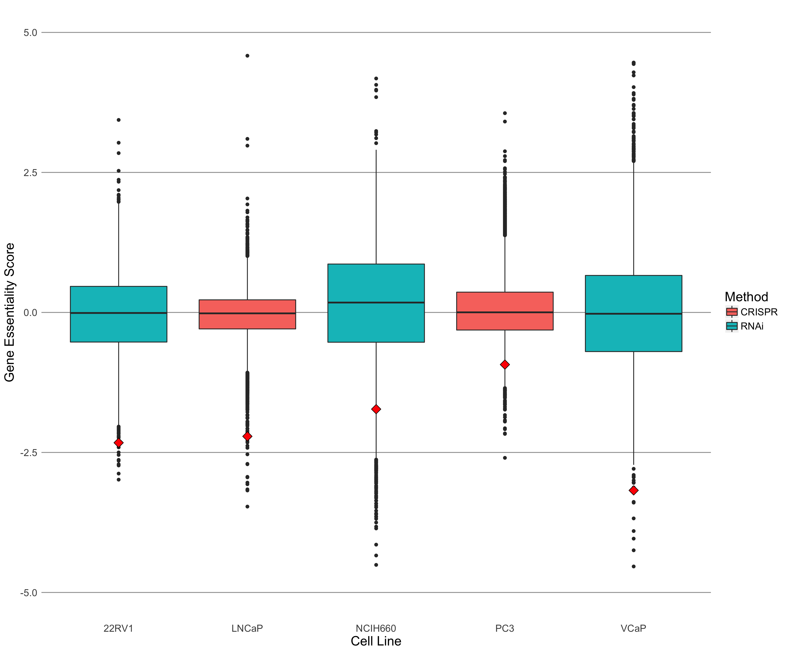

# Summary

Displaying gene essentiality, and highlighting FOXA1 from Project Achilles data.

## Data

Project Achilles contains data that tests for "gene essentiality" in a variety of cell lines.
They knock down/out genes using a variety of methods.
The two methods I've focused on here are either RNAi-based (`/data/external/Achilles_QC_v2.4.3.rnai.Gs.gct`)
or CRISPR-Cas9 (`/data/external/Achilles_v3.3.8.Gs.gct`).

In these datasets, there are gene essentiality data for 5 different prostate cancer cell lines.

| Cell Line Name | Method |
|----------------|--------|
| 22RV1 | RNAi |
| NCI-H660 | RNAi |
| VCaP | RNAi |
| PC3 | CRISPR-Cas9 |
| LNCaP | CRISPR-Cas9 |

While not specifically in the data for this folder, ENCODE only contains Hi-C data
for LNCaP cells, no other prostate cancer cell lines as of this date.

It's worth noting that Project Achilles describes their RNAi data as "quantile normalized",
and their CRISPR-Cas9 data as "z-score normalized".

## Results

The visualization of the data for the prostate cancer cell lines is below.

The essentiality score for FOXA1 is highlighted by the red diamond, in each sample.
Across all the different prostate cancer lines, FOXA1 is listed as an "essential" gene
(i.e. in the top quartile of essential genes).

> It is unclear how they've precisely "normalized" their data, given that the boxplots
do not have the same distribution.
The CRISPR-Cas9 plots are much narrower than the RNAi plots, for example.
It's possible they modelled each set as _N_(0, σ^2), instead of _N_(0, 1).
But even so, the NCI-H660 and VCaP distributions don't appear to be centred on 0.
However, I'm not sure how meaningful a question this is, and whether it's worth pursuing.

## Conclusions

FOXA1 is observable as an essential gene in a variety of prostate cancer cell lines.