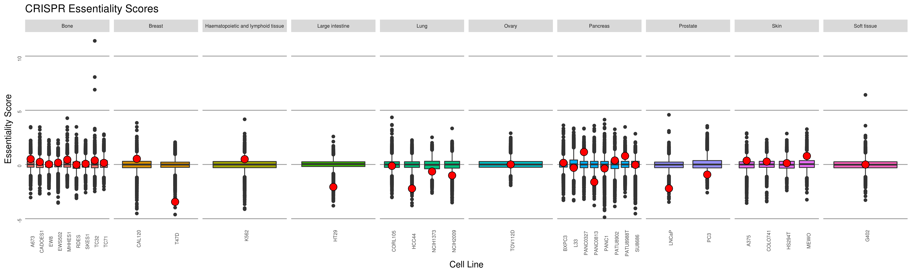
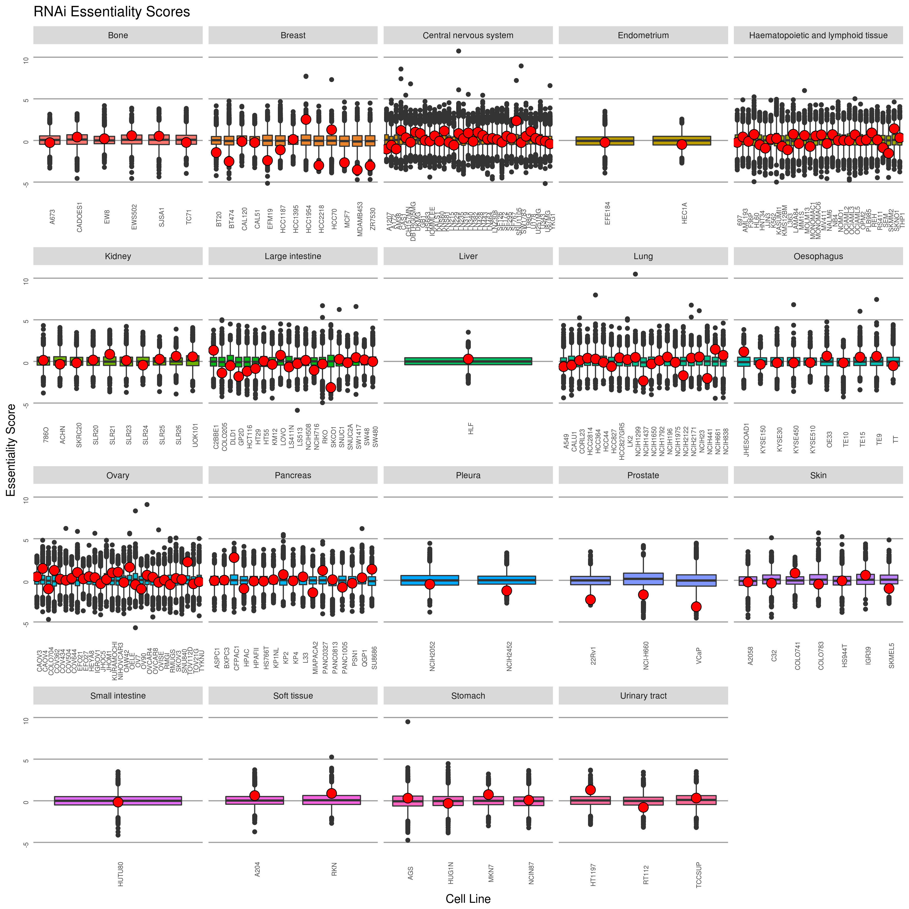

# Summary

Displaying gene essentiality, and highlighting FOXA1 from Project Achilles data.

## Data

Project Achilles contains data that tests for "gene essentiality" in a variety of cell lines.
They knock down/out genes using a variety of methods.
The two methods I've focused on here are either RNAi-based (`/data/external/Achilles/Achilles_QC_v2.4.3.rnai.Gs.gct`)
or CRISPR-Cas9 (`/data/external/Achilles/Achilles_v3.3.8.Gs.gct`).

In these datasets, there are gene essentiality data for 5 different prostate cancer cell lines.

| Cell Line Name | Method      |
| -------------- | ----------- |
| 22RV1          | RNAi        |
| NCI-H660       | RNAi        |
| VCaP           | RNAi        |
| PC3            | CRISPR-Cas9 |
| LNCaP          | CRISPR-Cas9 |

While not specifically in the data for this folder, ENCODE only contains Hi-C data
for LNCaP cells, no other prostate cancer cell lines as of this date.

It's worth noting that Project Achilles describes their RNAi data as "quantile normalized",
and their CRISPR-Cas9 data as "z-score normalized".

## Results

The visualization of the data for the prostate cancer cell lines is below.

The essentiality score for FOXA1 is highlighted by the red diamond, in each sample.
Across all the different prostate cancer lines, FOXA1 is listed as an "essential" gene
(i.e. in the top quartile of essential genes).

> It is unclear how they've precisely "normalized" their data, given that the boxplots
do not have the same distribution.
The CRISPR-Cas9 plots are much narrower than the RNAi plots, for example.
It's possible they modelled each set as _N_(0, σ^2), instead of _N_(0, 1).
But even so, the NCI-H660 and VCaP distributions don't appear to be centred on 0.
However, I'm not sure how meaningful a question this is, and whether it's worth pursuing.

### Permutation Tests

FOXA1 is present in all cell lines, and its essentiality varies depending on the
line and the tissue.

To explicitly show that FOXA1 is particularly important in prostate cancer cells
over other cell lines, we perform a permutation test.

#### Test 1

We calculate the probability that a randomly selected cell line will have an essentiality score lower than that of a prostate line.
This is done for both the CRISPRi and RNAi data.

The probabilities are as follows:

| Essentiality Method | _p_                |
| ------------------- | ------------------ |
| CRISPR              | 0.121212121212121  |
| RNAi                | 0.0339506172839506 |

#### Test 2

We calculate the median essentiality score for the 2 (3) prostate cancer lines from the CRISPRi (RNAi) data.
We then calculate the median score for all possible combinations of 2 (3) cell lines from the CRISPRi (RNAi) data.
We then find the proportion of combinations that have a smaller essentiality score (i.e. more essential) than the observed one.

The results for these 2 tests are as follows:

| Essentiality Method | _p_                 |
| ------------------- | ------------------- |
| CRISPR              | 0.0587121212121212  |
| RNAi                | 0.00454973556473231 |

See `combinations.R` for the code used to generate these results.

## Conclusions

FOXA1 is observable as an essential gene in a variety of prostate cancer cell lines (most importantly for this project, LNCaP, VCaP, and 22Rv1).