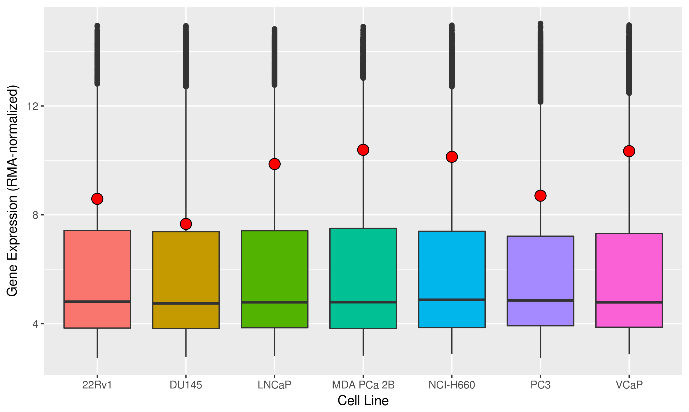
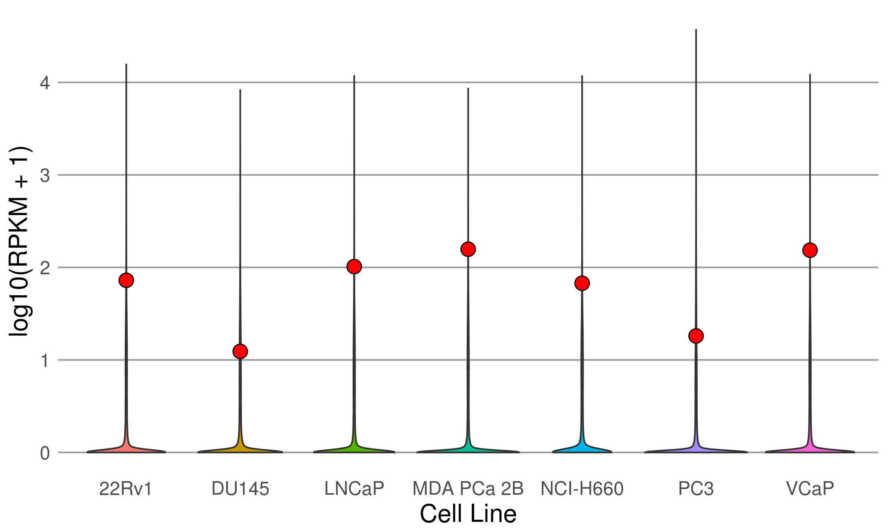

# Summary

## Motivation

I'm using publicly available data to see whether FOXA1 expression (i.e. mRNA abundance)
is highly expressed in prostate cancer relative to other genes.

Additionally, I'm interested in seeing whether FOXA1 expression is tissue specific
(i.e. if its high expression in prostate cancer is specific to prostate cancer and not others).

## Materials

### mRNA abundance data in prostate cancer cell lines

#### Microarray

I'm using mRNA microarray datasets from the CCLE for various prostate cancer cell lines:

* LNCaP
* VCaP
* 22Rv1
* PC-3 (maybe)
* NCI-H660 (maybe)
* MDA PCa 2b (maybe)
* DU 145 (maybe)

This has been downloaded from [CCLE legacy mRNA expression data](https://portals.broadinstitute.org/ccle/data)
(`CCLE_Expression_2012-09-29.res`) and is stored in `/data/external/CCLE/`.

As described, they were produced on the Affymetrix U133 Plus 2 human genome arrays.

#### RNA-seq

I'm also using RNA-seq read counts from the new [DEPMAP project](https://depmap.org/portal/dataset/omics).
This was downloaded from the [CCLE Portal](https://portals.broadinstitute.org/ccle/data)
(`CCLE_DepMap_18Q2_RNAseq_RPKM_20180502.gct`) and is stored in `/data/external/CCLE/`.

### mRNA abundance in prostate cancer human tissues

I'm using FPKM values from RNA-seq data from TCGA for the prostate cancer project.
I've downloaded these from the GDC Data Portal with the following filters:

| Parameter     | Filter                         |
| ------------- | ------------------------------ |
| Project Id    | TCGA-PRAD                      |
| Data Category | Transcriptome Profiling        |
| Data Type     | Gene Expression Quantification |
| Workflow Type | HTSeq - FPKM                   |

The manifest and the data for this dataset is `/data/external/TCGA-PRAD/`.

## Results

### FOXA1 is highly expressed in prostate cancer cell lines

#### Microarray evidence

Using CCLE mRNA microarray data, we see the following distribution of mRNA for
various cell lines.

The red highlighted circles correspond to FOXA1.
As shown, FOXA1 resides above the 75th percentile of genes expressed as mRNA across
various prostate cancer cell lines.

#### RNA-seq evidence

Using RNA-seq data from the DEPMAP project, we see the following distribution of
mRNAs for various cell lines.

Again, the red highlighted circles correspond to FOXA1.

## Conclusions
